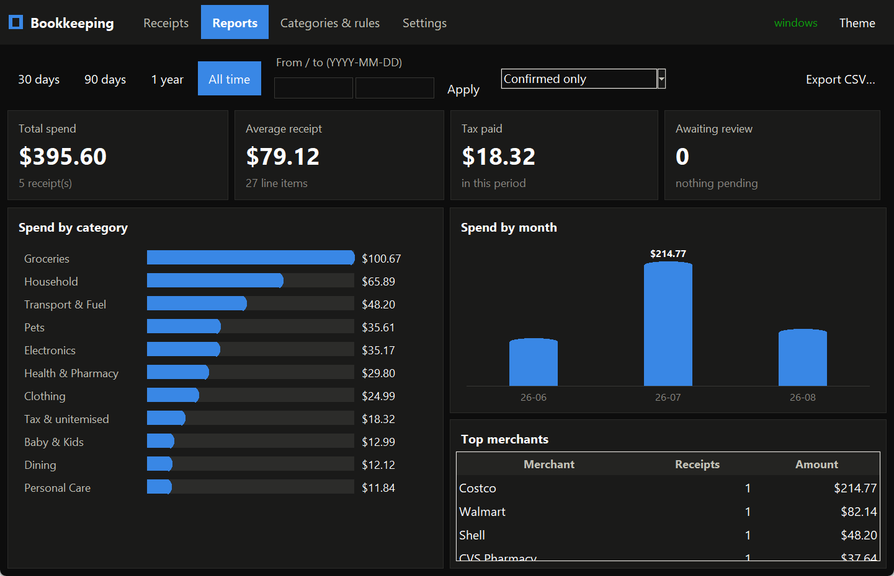
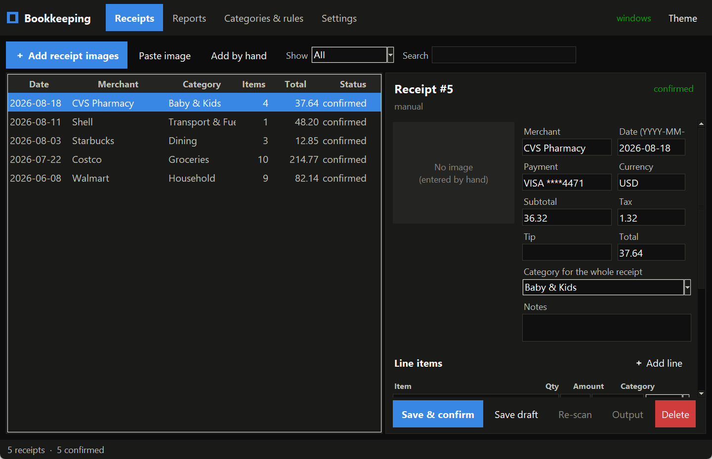
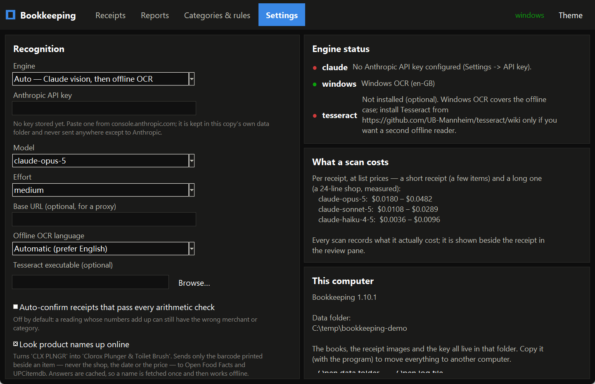
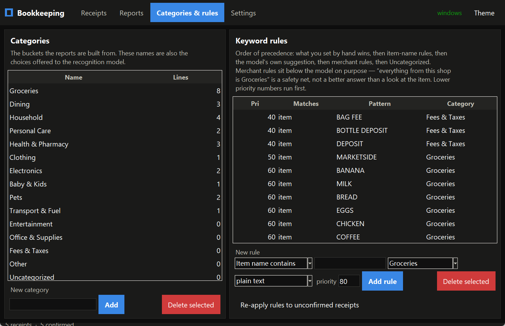

# Bookkeeping

Reads a photograph of a shop receipt into structured, double-checked accounts — line items,
categories, tax, totals — as a single portable Windows executable.

Recognition runs on the machine. There is no account, no login, and no server: the default
reader is the OCR engine already built into Windows, so the app works with no API key and
nothing to install. (Two *optional* enrichments do use the network — see
[Is it offline?](#is-it-offline) below, which answers that honestly rather than loosely.)



---

## Try it in two minutes

Windows 10 or 11, and Python 3.11+.

```bash
git clone https://github.com/Micheal-Jiaming/Bookkeeping.git
```

```bash
cd Bookkeeping && py -m venv .venv && .venv\Scripts\pip install -r requirements.txt
```

You do not need a receipt to look around. `seed_demo.py` fills a *separate* set of books with
plausible demo receipts — it requires an explicit `--data-dir` and refuses to touch books that
already have receipts, precisely so it can never be pointed at anyone's real data:

```bash
.venv\Scripts\python tools\seed_demo.py --data-dir C:\temp\bookkeeping-demo
```

```bash
run.bat --data-dir C:\temp\bookkeeping-demo
```

That is the screenshot above, reproducible on your own machine. To scan a real receipt, drop the
`--data-dir` and use **Add receipt images**. To build the standalone `.exe` (~28 MB, no Python
needed to run it), use `build.bat`.

---

## What it does

| | |
|---|---|
| **Read** | A photo or scan goes in. Three interchangeable engines, tried in order: Claude vision if an API key is present, then Windows' built-in OCR, then Tesseract if installed. Each receipt is read **twice** by the OCR path — at full size and shrunk — because neither size wins outright, and the two readings are merged. |
| **Check** | The line items are reconciled against the receipt's own printed subtotal and total. A reading whose numbers do not add up is **flagged for review, not silently accepted**. All money is integer cents end to end; no floating point touches a financial value. |
| **Categorise** | 15 categories and 176 seeded keyword rules, with an explicit precedence order — a value you set by hand always beats a rule, and item-name rules beat merchant-wide ones. Editable in the app. |
| **Report** | Spend by category and by month, top merchants, tax paid, CSV export, arbitrary date ranges. |
| **Speak** | Full English and Chinese interface, including machine-translated item names. |



---

## Accuracy, measured

Most hobby projects describe their accuracy in prose. Prose drifts, and it is not a measurement.
This one ships a harness — `py tools\measure_accuracy.py` recomputes every figure below, and
`--check` fails if any of them regressed:

```
photo            items     sum   unacc arith | hdr    lines m/x/i   names
----------------------------------------------------------------------------
ALDI1.jpg          11  49.72  15.45   BAD | (5/5)            -       -
ALDI1_new.jpg      15  53.89  11.28    ok | (5/5)            -       -
ALDI2.jpg           7  17.43   0.00    ok | (5/5)            -       -
Walmart1.jpg       23 136.47   5.47    ok |   5/5       23/1/0   18/23
Walmart2.jpg        3  23.52   0.00     - | (4/5)            -       -
Walmart3.jpg        6   9.12  25.98    ok | (5/5)            -       -
```

On the one receipt that has been transcribed by hand, `Walmart1.jpg`: **23 line items matched,
1 missed, 0 invented**, and the $5.47 the line items cannot account for is *exactly* the one
missed line. Header fields (merchant, date, subtotal, tax, total) 5 of 5.

Three design decisions in that harness are worth more than the numbers:

- **Ground truth and baseline are kept separate and never merged.** Ground truth is
  human-verified and measures *accuracy*; the baseline is machine-generated and only measures
  *regression*. Conflating them lets the program grade its own homework.
- **Invented lines are scored, not just missing ones.** An earlier change cut the reconciliation
  gap from $44 to under $3 — by inventing line items that were not printed on the paper. It was
  rejected. A metric that only rewards closing the gap actively rewards fabrication, so the
  harness counts `matched / missed / **invented**` and a fabricated improvement reports as a
  regression. There is a test asserting exactly that.
- **Lines are matched by amount, not by name**, because OCR reads amounts far more reliably than
  descriptions.
- `(5/5)` in brackets means *nothing is verified yet for that photo* — the score is
  self-consistency only. A parenthesis is not a pass, and the harness says so rather than
  letting the reader assume.

The harness earned its keep twice within a day of being written: it independently reproduced a
known missed line, then caught a claim the documentation had asserted wrongly for three sessions
(`ALDI1.jpg`'s tax reads `0.00` where the paper says `0.15`).

---

## Is it offline?

Recognition is. The app is not *entirely*, and the difference is worth stating precisely:

| | Network? | Key? | Default |
|---|---|---|---|
| **Windows OCR** — the built-in reader | No | No | active |
| **Tesseract** — optional second offline reader | No | No | off unless installed |
| **Claude vision** — the most accurate reader | Yes | **Your own** Anthropic key | unavailable without a key |
| **Barcode → product name** — Open Food Facts, UPCitemdb | Yes, keyless | No | **on** |
| **Item translation** — keyless endpoints | Yes, keyless | No | on, but only acts when the UI is Chinese |

The two enrichments are switchable in Settings, and both degrade to a no-op rather than an
error. The barcode lookup exists because nothing local can turn a till's `CLX PLNGR` into
"Clorox Plunger & Toilet Brush" — the words are simply not in the string. **It sends only the
barcode printed beside an item, never the shop, the date, or the price.**

If you supply an API key it is stored in this copy's own `data` folder and sent nowhere except
Anthropic. **No key ships with this repository, and there is no server in the middle** — each
install talks to Anthropic directly with its own key, so running this app cannot bill anyone
else's account.



---

## How it works

```
photo ──► engine (vision | Windows OCR | Tesseract)
             │
             ├─ word boxes regrouped into printed rows   (OCR path only)
             ├─ two passes at different scales, merged
             ▼
        receipt text parser ──► line items + header fields
             │
             ├─ barcode repair (11-digit UPCs zero-padded to 12)
             ├─ optional name expansion, then categorisation
             ▼
        validation: do the lines reconcile with the printed totals?
             │
             ├─ yes ──► saved (auto-confirm optional, off by default)
             └─ no  ──► flagged, with the shortfall named
             ▼
        SQLite (schema v6, versioned migrations) ──► reports, CSV
```

Python and Tkinter — no web framework, no browser, no GUI dependency to install. PyInstaller
produces the single `.exe`. **328 tests**; 12,722 lines of Python across 50 files.



---

## Status, and what it cannot do

Working and measured. Not finished, and the gaps are listed on purpose:

- **Only 1 of 6 receipt photographs is transcribed by hand**, so the line-level accuracy above is
  a claim about one receipt. The other five are scored on self-consistency only.
- **Two supermarket chains, tested.** It has never seen a restaurant or fuel receipt, which would
  break several structural parsing assumptions.
- **ALDI resolves 0 of 18 product names**, and this one will not be fixed: ALDI prints internal
  article numbers rather than barcodes, so there is nothing for a barcode lookup to resolve. ALDI
  already prints readable names, so there is also nothing to expand.
- **`ALDI1.jpg` misreads its tax** as `0.00` against a printed `0.15`. Whether that is a
  regression or an error in an older hand-written table is recorded as undetermined rather than
  guessed at.
- **Windows only.** `Windows.Media.Ocr` is an OS component; there is no macOS or Linux path.
- Receipt photographs are deliberately **not** in this repository — a real receipt is somebody's
  shopping and often their payment method. The receipt the project is measured against lives in
  the tests as OCR word boxes plus a transcription, which gives the same regression cover with
  nothing personal published.

---

## Development notes

**[`Bookkeeping.md`](Bookkeeping.md) is the real documentation** — roughly 2,100 lines covering
the architecture, every design decision with the alternatives that were rejected, the full fix
history, and the reasoning behind each feature. It is written to be picked up cold by someone
who has never seen the project.

This was built with heavy AI assistance. I set the requirements and the hard constraints, owned
the real-receipt test corpus, decided what shipped, and reviewed what was produced — including
rejecting the change described above that improved the headline metric by fabricating data. I did
not hand-write most of the code, and I would rather say so than imply otherwise.
